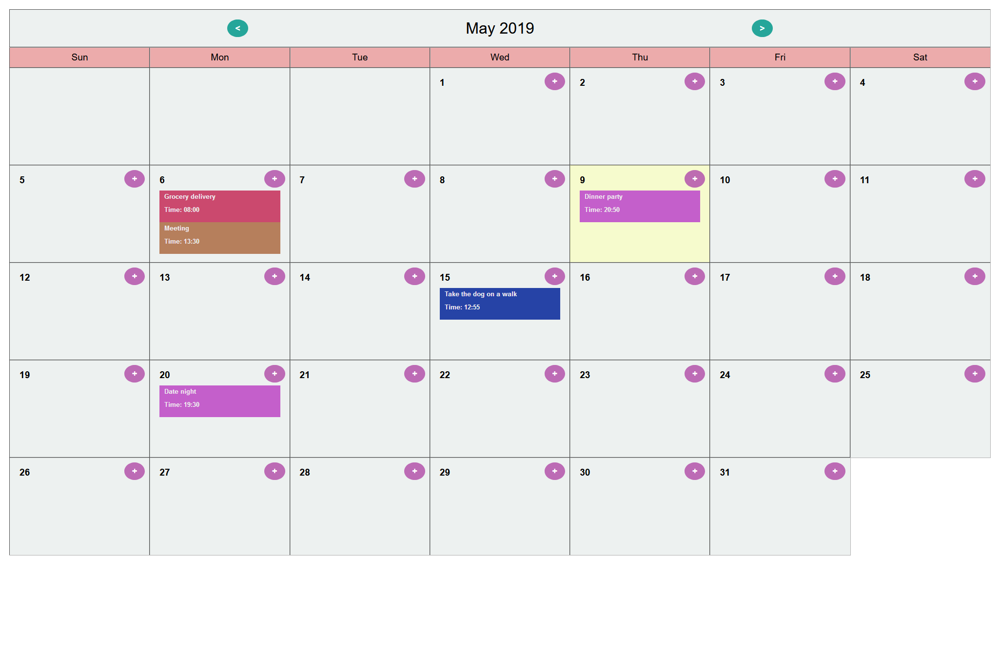
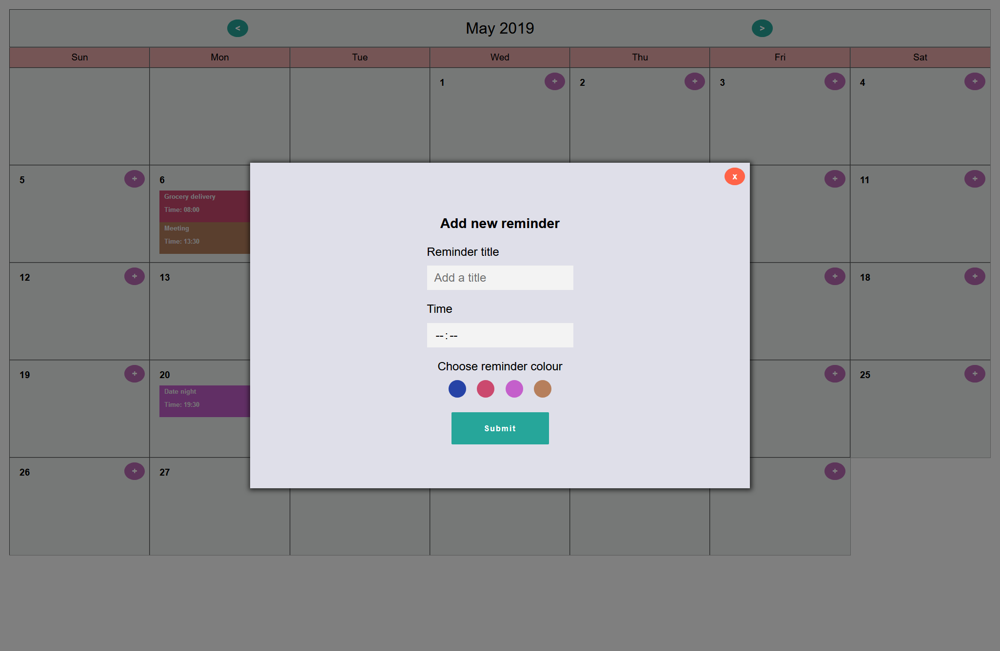

# React/Redux Developer Task - React Calendar

The aim of this exercise is to create a demo calendar application using React & Redux.

You should start by rendering a single month view of a calendar for the current month - along the lines of the below illustration:

Once this is rendered, please implement as many of the following requirements as time allows:

- Ability to add a new “reminder” for a user entered day and time.
- Display reminders on the calendar view in the correct time order.
- Allow the user to select a colour when creating a reminder and display it appropriately.
- Properly handle overflow when multiple reminders appear on the same date.
- Ability to edit reminders – including changing text, day and time & colour.
- Ability to delete reminders.
- Expand the calendar to support more than current month.

## What my attemp at this challenge looks like

What currently works:

- Adding, Updating, Deleting reminders
- Setting reminder time, title and colour
- Calendar can switch between months and retain state of reminders etc.

Things that still need to be done:

- Displaying overflow of reminders
- Ordering reminders

Things I could improve:

- Tidy up the structure of the project
- Split the 'rootReducer' into 'calendar' and 'reminder' - specific files
- Reduce code duplication in reducers
- Mobile calendar view - this is currently broken
- General tidy up of styling (moving common colours and styles to a shared 'theme' object to improve reusability and consistency)

---

This project was bootstrapped with [Create React App](https://github.com/facebook/create-react-app).

## Available Scripts

In the project directory, you can run:

### `npm start`

Runs the app in the development mode. 
Open [http://localhost:3000](http://localhost:3000) to view it in the browser.

The page will reload if you make edits. 
You will also see any lint errors in the console.

### `npm test`

Launches the test runner in the interactive watch mode. 
See the section about [running tests](https://facebook.github.io/create-react-app/docs/running-tests) for more information.

### `npm run build`

Builds the app for production to the `build` folder. 
It correctly bundles React in production mode and optimizes the build for the best performance.

The build is minified and the filenames include the hashes. 
Your app is ready to be deployed!

See the section about [deployment](https://facebook.github.io/create-react-app/docs/deployment) for more information.
